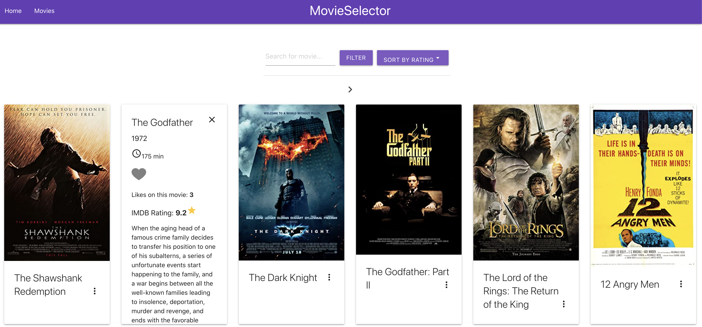
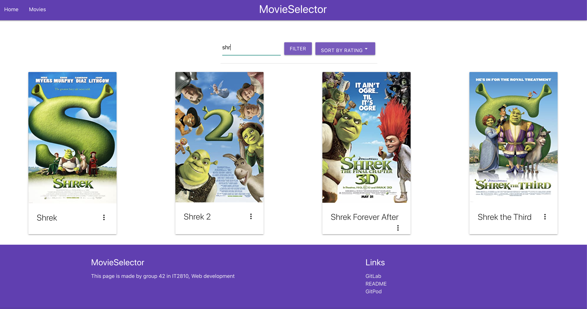
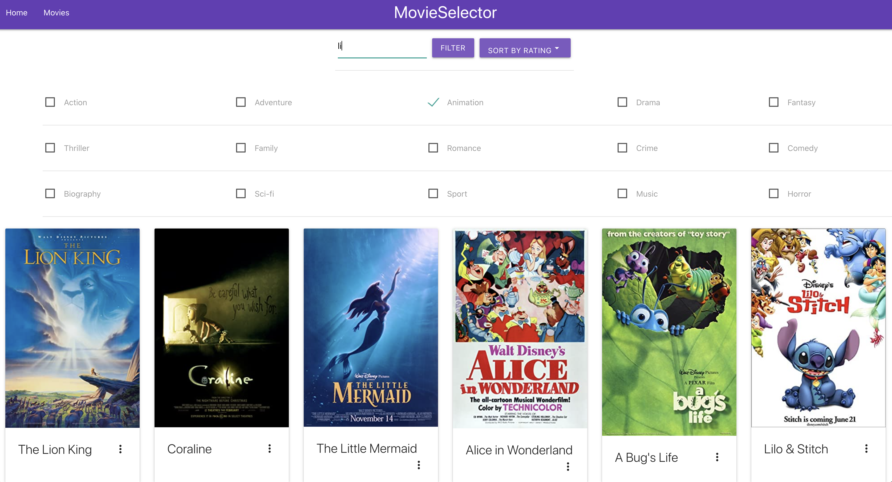
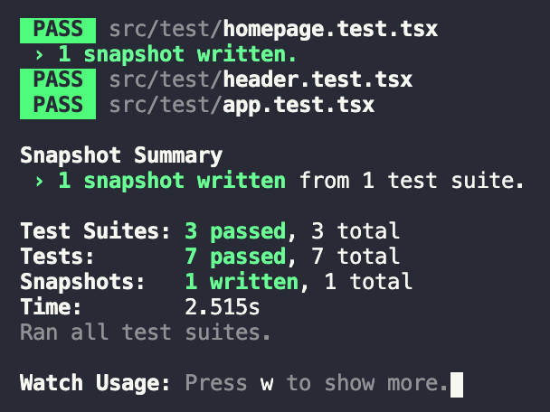
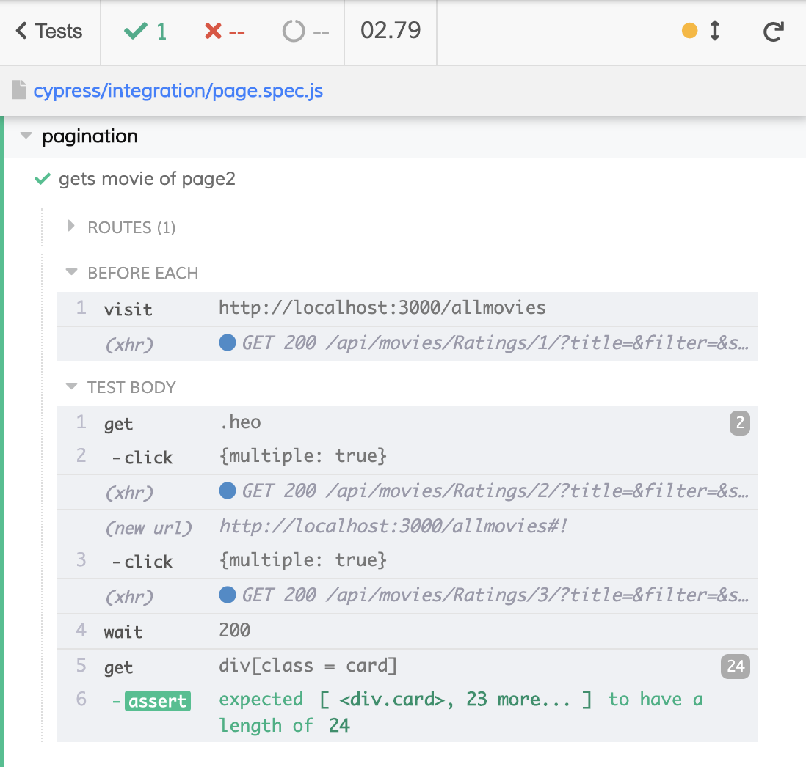
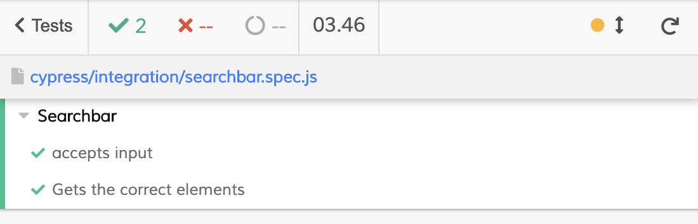

# Project 3

## Innhold
1. [Om](#om)
2. [Teknologi](#teknologi)
    1. [React](#React)
    2. [Redux](#REDUX)
    3. [REST API](#REST API)
    4. [Tredjepartsomponenter](#komponenter)
    5. [MongoDB](#MongoDB)
3. [Testing](#testing)
    1.[Enhetstesting](#Enhetstesting)
    2.[ent-to-end testing](#end-to-end)
4. [Installering](#Installering)
5. [Bruk av git](#git)
6. [Sources](#source)

# Om prosjektet <a name="om"></a>:
I dette prosjektet har vi laget en nettside for filmsøk. Webapplikasjonen lar deg søke, filtrere, sortere, bla og like filmer. 
Når du kommer inn på hovedsiden kan du trykke deg inn på "Movies" øverst i navigasjonsbaren, der du kan finne nærmere 900 filmer vi har hentet fra et public API. 
Trykker du på filmposterne vil du få opp ytterlige informasjon om filmene som blant annet tittel, utgivelsesår, varighet, IMDB-rating og et 
lite sammendrag av hver film. Her vil du også få muligheten til å se hvor mange som har likt filmen, samt gi din egen like/unlike 
ved å trykke på hjertet. Brukeren kan både søke, filtrere og sortere på hele filmsettet, og resultatet blir representert 
på ulike sider man kan bla seg gjennom. Vi har satt default sorteringen basert på rangering, siden vi tenker at dette er det mest naturlige valget slik at de best
rangerte filmene havner øverst. Både søk, filtrering og sortering fungerer om hverandre og man kan gjøre alle operasjonene samtidig dersom man ønsker et mer 
spesifisert søk. 





# Teknologi <a name="teknologi"></a>:


### React <a name="react"></a>:
Prosjektet er basert på React og har blitt initialisert med create-react-app. De funksjonelle komponentene og klassene er implementert ved hjelp av JSX og Typescript. 

Vårt prosjekt er satt opp av ulike komponenter der alt blir satt sammen i App.tsx. Derfra er det en
Router som bytter mellom hjemmesiden og siden som viser alle filmene. Inne i Content.tsx har vi alle filmene som skal vises, består blant annet av underkomponenter som moviebox som viser alle film-komponentene, filternav som viser de ulike filtrene. For å sende med ulike parametere fra databasen til ulike komponenter, har vi tatt i bruk props.

Vi har i tillegg lagt til en funksjon som gjør at en bruker kan like en film.  Hver gang en bruker klikker på hjertet blir det gjort et axios-kall og bruker app.put for å oppdatere databasen. 

Stylingen i dette prosjektet har vi prøvd å holde ganske enkel da det meste kom med Materialize. I tillegg har vi tatt i bruk flexbox og tabeller for å få alt til å ligge som vi ønsket. 


### Redux <a name="redux"></a>:
Redux var noe medlemmene på gruppen ikke hadde vært borti før, så dette var noe vi ønsket å lære oss. Redux gir oss muligheten til å lagre verdier globalt slik at vi kan bruke verdiene ulike steder i applikasjonen vår.
Dette var noe vi tok i bruk for å gjøre et filtrert søk. De ulike verdiene som brukeren ønsker å filtrere på, blir lagret i en liste som viser alle filmene med de aktuelle sjangerne. Dette blir gjort i store.tsx og ved 
hjelp av en Reducer-funksjon som ligger i updateGenreFilter.ts som legger til nye filtre i listen. Ved å ta i bruk Redux Devtools, som er en extention i Google Chrome, kan vi nå sjekke om filtre som blir krysset av blir lagt i staten. 




### REST API <a name="REST API"></a>:
Vi implementerte et REST API med Node.js, Express og MongoDB som database. Løsningene er implementert ved hjelp av typescript og vi brukte [denne](https://levelup.gitconnected.com/setup-restful-api-with-node-js-express-mongodb-using-typescript-261959ef0998) guiden for å sette opp REST APIet. Vi bestemte oss for å bruke REST API istedenfor
GraphQL ettersom dette er standaren for de fleste selskaper som jobber med og benytter seg av API. Vi følte dermed dette var nyttig å lære seg. I Backend prosjektet opprettet vi en lib mappe der vi la inn alle typescript filene.
Siden vi kjører prosjektet i Node.js må vi konvertere filene til javascript filer. Dette gjøres automatisk og de nye javascriptfilene blir lagt inn i dist mappen. Inne i routes har vi implementert endepunktene. I movie_routes har
vi lagt inn et endepunkt:
````
Get: "/api/movies/:sort/:page/" 
````
som tar for seg både filtrering, søk og sortering. Vi har kun laget ett endepunkt for dette ettersom vi ønsker at filtrering, søk og sortering skal fungere om hverandre.
Vi har også opprettet et endepunkt for brukergenerert data:
````
Put: "/api/dislike/:movieid"
````
Put brukes for å sende data til databasen, slik at når en bruker liker en film med en gitt movieid vil dette oppdateres i databasen.  
Inne i modules mappen finner man schema.ts ,model.ts(interfacet) og service.ts. Interfacet viser hvilken data vi ønsker å ha med fra databasen. 
I service.ts og movieController.ts ligger alt av spørringer og logikk for søk, filtrering og sortering. I config mappen finner man app.ts 
som blant annet tar for seg koblingen med databasen. 


### Tredjepartskomponenter <a name="komponenter"></a>:
I denne prosjektet brukte vi Materialize som tredjepartskomponent da dette var noe vi hadde kjennskap til fra før. Her fikk vi gjenbrukt mye kode, og alt av design 
var mye lettere å håndtere enn om vi hadde implementert fra bunnen av. Fra Materialize hentet vi blant annet design til header, footer, slideshow og filmkomponentene. 
I tilegg ble noe Java-script importert fra bibloteket deres som gjorde at for eksempel slideshowet, og det at info kommer opp dersom man trykker på en filmkomponent.

### MongoDB <a name="MongoDB"></a>:
For å legge til data i databasen startet vi først med et public API der vi fikk lastet ned en .csv-fil vi bare kunne laste opp i MongoDB. 
Når vi da skulle vise dataene fra APIet, fant vi ut at det ikke inneholdt bilder, som var noe vi ønsket. Derfor bestemte vi oss for å bytte API, til et API med bilder. 
Dette var litt mer jobb, siden det eneste APIet vi fant var et API som var avhengig av IMDB sin film ID. Derfor var vi nødt til å beholde ID-ene vi fikk fra det første APIet 
og lage et script  som gikk gjennom alle ID-ene for deretter å hente ut resterende informasjon fra et API som hadde mer utfyllende informasjon som bilder og plot. Deretter måtte all informasjonen 
bli skrevet inn i en .csv-fil slik at det kunne bli lastet opp på MongoDB. Dette gjorde vi i Backend -> controller i fetchMovies og movie_ids. API-et vi brukte 
tillot kun å ta ut ca 900 filmer per dag, og vi tenkte dette ville holde for vår funksjonalitet. 


# Testing <a name="Testing"></a>:

## Enhetstestning <a name="Enhetstesting"></a>:
For enhetstesting har vi benyttet oss av Jest og Enzyme. Alle testene ligger under test mappen inne src. Vi har benyttet oss av expect i Jest for å sjekke om en 
fil inneholder og returnerer det vi ønsker. Vi bruker Enzyme for å lage en shallow rendering av komponentene vi ønsker å teste.Vi har også kjørt en snapshottest i homepage.test.tsx.
Vi fikk litt dårlig tid på slutten av prosjektet og fikk dermed ikke satt oss så mye inn i enhetstesting som vi ønsket. Vi skulle gjerne tatt i bruk mock og litt mer avanserte enhetstester
enn det vi gjør, men dette er noe vi må se videre på ved senere prosjekter. Vi valgte derfor å prioritere end-to-end i dette prosjektet. 

For å kjøre testene gå inn i frontend mappen og skriv:
````
npm test
a
````



Gjennomgående testing av applikasjonen er viktig for å kunne sikre konsekvent funksjonalitet og responsivitet på forskjellige bruksenheter.
## End-2-end <a name="end-to-end"></a>:
Vi valgte å bruke Cypress til end-2-end testing. Cypress ga oss gode tilbakebeldigner på tilsatanden til siden. Vi valgte å teste søk-funksjonen og bla i filmene. 
Det er viktig å ha gode tester for applikasjonen for å sikre konsekvenr funksjonalitet og responsivitet på forskjellige bruksenheter. For videre utvikling ville vi ha testet filter og sortering også. Testene ligger under ````Frontend/Cypress/Integration````

For å kjøre testene, må både Frontend og Backend være startet med 
````
npm start
````
i Frontend-mappen, og
````
npm run dev
````
i Backend-mappen. I tillegg 
````
npm install cypress --save-dev
node_modules\.bin\cypress open
````
i Frontendmappen.






# Installering <a name="Installering"></a>:
For å kunne kjøre prosjektet må man enten være koblet til NTNU nett eller NTNUs VPN. 

1. Klon git repoet med SSH/HTTP i ønsket lokasjon.
2. Lokaliser deg til backend mappen og kjør 

````
npm install
npm run dev
````

3. Deretter lokaliser deg inn i frontendmappen og skriv 

````
npm install
npm start
````


# Bruk av git <a name="git"></a>:
Under hele prosjektet har vi brukt git flittig. Hele prosjektet startet med å sette opp wireframes slik at vi alle var inneforstått med hvordan vi ønsket at siden skulle se ut.
Deretter satte vi opp ulike issues for nettsiden vår, og delte ut arbeidsoppgaver. I startfasen hadde vi noe problemer med å få sette opp backend samt koble opp virituell maskin, så 
dette tok dessverre mye av tiden vår i starten. Når vi først kom i gang fikk alle medlemmene utdelt issues som vi ønsket å jobbe med. Ble man ferdig med issuet sitt, kunne man fortsette
på neste uferdige issue. På den måten, kom vi gjennom alt som måtte gjøres. Vi var ikke like flinke til å close issuesene fortløpende som vi ønsket, men alle issuesene ble utført. 
Siden ble noe anderledes enn det vi først så for oss siden vi kanskje var litt for ambisiøse. Noe vi ikke rakk å implementere var det å kunne trykke på en film og komme til en ny side 
som hadde mer utfyllende informasjon om de ulike filmene. Vi valgte heller at man kunne trykke på hver film og lese direkte i filmbibloteket da kravet var å kunne se mer detaljer om hver film, noe vi har.
Et annet issue som ikke ble fullført 

Vi har alltid sørget for at alle skulle være oppdatert til en vær tid, og vite hvilken branch som har de nyeste oppdateringene. 
I tillegg var det også viktig for oss å alltid ha en back-up-branch der all nylig implementert funksjonalitet fungerte som det skulle slik at vi alltid hadde noe 
å gå tilbake til dersom ting ikke fungerte som det skulle. I dette prosjektet har vi opprettet utrolig mange brancher siden vi har gjort mye feil og har måttet gått frem og tilbake
flere ganger. Fra tidligere prosjekt, ville vi forbedre oss på det med commits meldinger og branchnavn. Dette har vi vært flinkere på under dette prosjektet, men det kunne vært bedre.
Som sagt, har vi prøvd mye forskjellig og testet mye ulik funksjonalitet/setup som har resultert i noen ugunstige branchnavn. Commitsene derimot, har vi vært litt mer konsekvens og 
vært litt mer beskrivende i forhold til hvilke funksjonalitet vi ønsket å implementere. 


# Sources <a name="source"></a>:

* https://materializecss.com/

* http://www.omdbapi.com/
* https://levelup.gitconnected.com/setup-restful-api-with-node-js-express-mongodb-using-typescript-261959ef0998
* https://www.youtube.com/watch?v=Tqe0Knpt6lY&t=5s  

